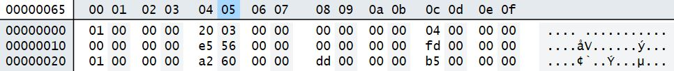

# Cheats

Cheats are formatted similar to NES_MISTer Core: [MISTer Cheats](https://mister-devel.github.io/MkDocs_MiSTer/cores/features/cheats/), but MISTer zips all `.gg` cheats and uses a Linux Kernel that can easily unzip it. We'll use a different approach here: pack all cheats into a single binary `.cwz` (CheatWizard) file.

## Format

- 16 bit words
- Little Endian format

|         byte                 |      byte   |      byte   |    byte       |     2 byte     |
|------------------------------|-------------|-------------|---------------|----------------|  
| Flag - Compare value enabled | Address LSB | Address MSB | Compare value |  Replace value | 

## Example:

01 00 00 00 A0 1C 00 00 B5 00 00 00 FF 00 00 00

The first four bytes are little-endian 0x0000_0001 for "compare enabled", the second two are little-endian address, third set are compare value, and fourth is replace value. Note that not all codes use a compare value.

This needs to be translated to a binary file, appending one cheat after the other:

Check `cheats/Battletoads` for an example